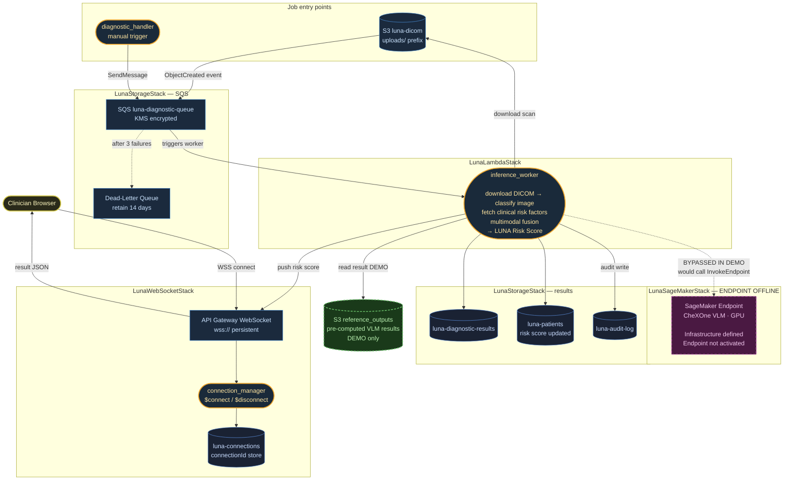
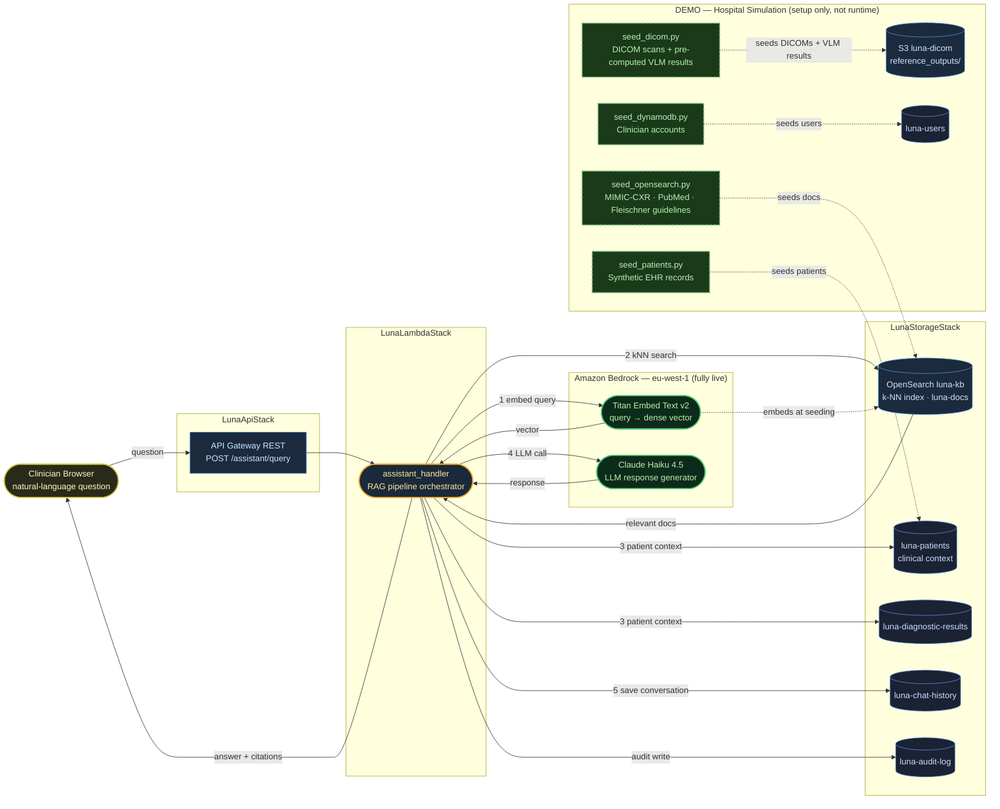

# LUNA — Serverless Thoracic Screening AI Platform

> **Cloud Computing & Big Data Architecture — MSc Data Science, FIB**  
> Team: Carlos Gil · Geming Wu · Iván Quirante · Marta Borrás · Zheshuo Lin

---

## What is LUNA?

LUNA (**L**ung **U**nit k**N**owledge **A**ssistant) is a fully serverless, cloud-native clinical decision support platform for **thoracic X-ray screening and pulmonary disease follow-up**. It is deployed entirely on AWS and requires zero server management.

Clinicians interact with a single web interface that combines:

| Capability | Technology |
|---|---|
| **AI risk scoring** from chest X-rays | CheXOne VLM via Amazon SageMaker *(partially implemented — see below)* |
| **Annotated X-ray viewer** with bounding boxes | Pre-computed VLM outputs stored in S3 |
| **Patient triage list** sorted by LUNA Risk Score | DynamoDB + Lambda |
| **AI clinical assistant** with medical literature citations | Amazon Bedrock (Claude) + OpenSearch RAG |
| **Real-time result delivery** | API Gateway WebSocket + SQS |

### Demo entry point

```
URL:       <NEXT_PUBLIC_FRONTEND_URL>
Username:  xxx
Password:  xxx
```

---

## How the demo works

The demo environment is pre-loaded with **5 real patient cases** from the VinDr chest X-ray dataset. All diagnostic outputs (risk scores, pathology predictions, bounding boxes) are pre-computed and stored in S3 — no live SageMaker GPU endpoint is needed to run the demo.

**Workflow from the browser:**

1. Log in → land on the triage dashboard showing 5 patients sorted by LUNA Risk Score (highest risk first).
2. Click any patient → see their EHR summary, raw X-ray, and annotated X-ray (bounding boxes drawn by the VLM).
3. Ask the AI assistant a clinical question in natural language → receive a structured, citation-backed answer grounded in indexed medical literature.

> **Note on SageMaker:** The full inference pipeline (S3 upload → SQS → Lambda → SageMaker async → WebSocket push) is implemented in code but the live GPU endpoint is kept offline to avoid continuous infrastructure costs. The `inference_worker` Lambda automatically falls back to the pre-computed S3 outputs for the 5 demo patients.

---

## Architecture overview (see Last Section on Architecture refference for more insights)

```
Browser (CloudFront + Next.js)
    │
    ├── REST API (API Gateway)          ← all routes protected by Lambda Authorizer
    │       ├── POST /auth/login         → auth_handler
    │       ├── GET  /patients           → patient_handler
    │       ├── GET  /patients/{id}      → patient_handler
    │       ├── POST /patients/{id}/diagnose → diagnostic_handler → SQS
    │       └── POST /assistant/query    → assistant_handler (RAG + Bedrock)
    │
    └── WebSocket API (API Gateway)      ← real-time push
            └── $connect / $disconnect  → connection_manager
                                               ↑
S3 event → SQS → inference_worker Lambda ──────┘
                        ↓
          reference_outputs/{id}/results.json   ← pre-computed VLM (demo)
          OR SageMaker InvokeEndpointAsync       ← live inference (production)
```

**Six CDK stacks** deploy the full system in `eu-west-1`:

| Stack | What it creates |
|---|---|
| `LunaStorageStack` | S3 bucket, 7 DynamoDB tables, SQS + DLQ, KMS key, Secrets Manager |
| `LunaWebSocketStack` | API Gateway WebSocket API + `connection_manager` Lambda |
| `LunaSageMakerStack` | SageMaker model + endpoint config (offline in demo) |
| `LunaLambdaStack` | All 8 Lambda functions + IAM grants + SQS event source |
| `LunaApiStack` | REST API Gateway + Lambda Authorizer + all routes |
| `LunaFrontendStack` | S3 frontend bucket + CloudFront distribution |

---

## Repository layout

```
├── backend/lambdas/        # 8 Lambda handlers (Python 3.11)
│   ├── auth_handler/       # login, logout, session management
│   ├── authorizer/         # custom token validation for API Gateway
│   ├── patient_handler/    # patient list + detail
│   ├── upload_handler/     # pre-signed S3 URL generation
│   ├── diagnostic_handler/ # enqueue diagnostic job to SQS
│   ├── inference_worker/   # SQS consumer: runs VLM + pushes result via WebSocket
│   ├── assistant_handler/  # RAG pipeline: OpenSearch + Bedrock
│   └── connection_manager/ # WebSocket connect/disconnect
├── data_ingestion/         # one-off seed scripts (run after deploy)
│   ├── seed_dynamodb.py    # create demo user account
│   ├── seed_dicom.py       # upload DICOMs + pre-computed VLM outputs to S3
│   ├── seed_opensearch.py  # chunk PDFs → embeddings → OpenSearch index
│   └── seed_patients.py    # load 5 demo patients into DynamoDB
├── frontend/               # Next.js 14 + Tailwind CSS
├── infrastructure/         # AWS CDK (Python) — 6 stacks
├── ml/chexone_test_production/
│   └── data/
│       ├── dicoms/         # 5 DICOM files (VinDr dataset)
│       ├── reference_outputs/  # pre-computed VLM JSON + PNG renders
│       ├── ehr/            # patient EHR JSON files
│       └── rag/            # medical PDF documents for RAG indexing
└── tests/                  # unit + integration tests
```

---

## Quick start

See **[DEPLOYMENT_INSTRUCTIONS.md](./DEPLOYMENT_INSTRUCTIONS.md)** for the full step-by-step guide.

Short version:

```bash
# 1. Deploy infrastructure
cd infrastructure && cdk deploy --all --require-approval never

# 2. Seed data (after OpenSearch domain is Active, ~15 min)
cd data_ingestion
python seed_dynamodb.py    # create demo user
python seed_dicom.py       # upload DICOMs + VLM outputs to S3
python seed_opensearch.py  # index medical literature
python seed_patients.py    # load 5 demo patients into DynamoDB

# 3. Build and deploy frontend
cd frontend && npm install && npm run build
aws s3 sync out/ s3://$FRONTEND_BUCKET --delete
```

# LUNA — Architecture Reference

## Diagram 1 — Frontend & REST API

Covers the synchronous path: how the browser reaches each Lambda and which data stores each handler reads or writes.

```mermaid
%%{init: {"themeVariables": {"fontSize": "18px"}}}%%
flowchart TB

    classDef default font-size:18px
    classDef client fill:#2a2a1a,stroke:#d4c84a,stroke-width:2px,color:#fff8c0,font-size:18px
    classDef aws    fill:#1b2a3d,stroke:#4a90d9,color:#cce4ff,font-size:18px
    classDef fn     fill:#1a2a3a,stroke:#f0a830,stroke-width:2px,color:#ffe4a0,font-size:18px
    classDef db     fill:#1a2233,stroke:#5b8dd9,color:#c8dcff,font-size:18px
    classDef secret fill:#2a1a33,stroke:#9b59b6,color:#e8d5ff,font-size:18px

    BROWSER(["Clinician Browser"]):::client

    %% ── Row 1: entry points ──────────────────────────────────────────────
    subgraph FESTACK["LunaFrontendStack"]
        direction LR
        CF["CloudFront CDN"]:::aws --> S3FE[("S3 — Next.js static build")]:::aws
    end

    subgraph APISTACK["LunaApiStack"]
        direction LR
        APIGW["API Gateway REST"]:::aws -->|"protected routes"| AUTHZ(["Lambda Authorizer\nchecks session token"]):::fn
    end

    %% ── Row 2: handlers ──────────────────────────────────────────────────
    subgraph HANDLERS["LunaLambdaStack"]
        direction LR
        AUTH_FN(["auth_handler\nlogin / logout"]):::fn
        PAT_FN(["patient_handler\nlist & detail"]):::fn
        UP_FN(["upload_handler\npre-signed S3 PUT"]):::fn
        DX_FN(["diagnostic_handler\nenqueue ML job"]):::fn
        AST_FN(["assistant_handler\nRAG + LLM"]):::fn
    end

    %% ── Row 3: storage — all combined ────────────────────────────────────
    subgraph LUNASTORAGE["LunaStorageStack"]
        direction TB
        
        subgraph AUTH_DATA["Auth & Security"]
            direction LR
            TBL_USR[("luna-users")]:::db
            TBL_SES[("luna-sessions\nTTL 24 h")]:::db
            TBL_LOGIN[("luna-login-attempts")]:::db
            SECRET[/"Secrets Manager\nHMAC salt"/]:::secret
        end

        subgraph APP_DATA["Application Data"]
            direction LR
            TBL_PAT[("luna-patients")]:::db
            TBL_DX[("luna-diagnostic-results")]:::db
            TBL_CHAT[("luna-chat-history")]:::db
            S3DICOM[("S3 luna-dicom")]:::aws
        end

        TBL_AUDIT[("luna-audit-log — PITR · 7-yr retention")]:::db
    end

    %% ── Legend (Pinned to bottom-right) ──────────────────────────────────
    subgraph LEGEND["Legend"]
        direction TB
        L_CLIENT(["Client"]):::client
        L_AWS[("AWS Service")]:::aws
        L_FN(["Lambda Function"]):::fn
        L_DB[("Database / Storage")]:::db
        L_SEC[/"Secret"/]:::secret
    end

    %% ── Flows ────────────────────────────────────────────────────────────
    %% Frontend
    BROWSER -->|"HTTPS"| FESTACK

    %% REST + authorizer
    BROWSER -->|"REST"| APIGW
    AUTHZ   -->|"token lookup"| TBL_SES

    %% Route dispatch (APIGW → each handler)
    APIGW -->|"POST /auth/*"| AUTH_FN
    APIGW -->|"GET  /patients"| PAT_FN
    APIGW -->|"POST /upload"| UP_FN
    APIGW -->|"POST /diagnose"| DX_FN
    APIGW -->|"POST /assistant/query"| AST_FN

    %% auth_handler → Auth & Security tables
    AUTH_FN --> TBL_USR & TBL_SES & TBL_LOGIN
    AUTH_FN -->|"read salt"| SECRET

    %% patient_handler → App tables
    PAT_FN --> TBL_PAT & TBL_DX
    PAT_FN -->|"pre-signed GET"| S3DICOM

    %% upload_handler → App tables
    UP_FN -->|"pre-signed PUT"| S3DICOM
    UP_FN --> TBL_PAT

    %% diagnostic_handler → App tables
    DX_FN --> TBL_PAT & TBL_DX

    %% assistant_handler → App tables
    AST_FN --> TBL_PAT & TBL_DX & TBL_CHAT

    %% All handlers → audit (converge at bottom)
    AUTH_FN & PAT_FN & UP_FN & DX_FN & AST_FN -->|"audit write"| TBL_AUDIT

    %% Invisible link to force the Legend to the right of the storage stack at the bottom
    LUNASTORAGE ~~~ LEGEND
```




### How it works

**CloudFront + S3** serve the Next.js static build globally over HTTPS. The browser never talks to a backend server — all API calls go to API Gateway.

**Lambda Authorizer** sits in front of every protected route. It validates the session token against `luna-sessions` and returns an IAM `Allow` or `Deny` inline — rejected requests never reach the handler.

**Handlers are single-purpose.** `auth_handler` manages authentication (bcrypt + Secrets Manager HMAC salt, rate-limited via `luna-login-attempts`). `upload_handler` and `patient_handler` issue pre-signed S3 URLs so DICOM files are transferred directly between the browser and S3 — they never pass through API Gateway. `diagnostic_handler` only validates and enqueues; the ML work happens asynchronously (Diagram 2). `assistant_handler` runs the RAG pipeline (Diagram 3).

**Every handler writes to `luna-audit-log`** — PITR-enabled, deletion-protected, 7-year TTL — for healthcare compliance.

---

## Diagram 2 — Async Inference Pipeline & Real-Time Push

Covers the ML path: from a DICOM arriving in S3 to the risk score pushed back to the browser over WebSocket.



**Legend**

| Style | Meaning |
|---|---|
| Rounded rect, yellow border | Lambda function |
| Rect / cylinder, blue border | AWS managed service (live) |
| Dashed purple border | Partially implemented — offline in demo |
| Dashed green border | Demo substitute — not runtime |
| Solid arrow | Live data flow |
| Dashed arrow | Bypassed or conditional path |

### How it works

**Two job entry points, one queue.** S3 fires an `ObjectCreated` event automatically when a DICOM lands in `uploads/`. `diagnostic_handler` fires manually (with clinical context attached) when the clinician clicks *Diagnose*. Both paths converge in `luna-diagnostic-queue`, which decouples the synchronous HTTP response from the ML computation.

**`inference_worker` runs multimodal fusion.** It downloads the scan, classifies the image (SageMaker in production / pre-computed S3 result in demo), reads the patient’s clinical risk factors from DynamoDB, and fuses both signals into a single **LUNA Risk Score**.

**SageMaker is infrastructure-complete but offline.** The CDK stack provisions the model and endpoint config. The endpoint activates once a trained `model.tar.gz` is supplied via CDK context — no code changes needed. The demo reads from `S3://luna-dicom/reference_outputs/` instead.

**Results are pushed instantly via WebSocket.** `inference_worker` POSTs to the API Gateway Management API with the stored `connectionId`. The risk score appears in the browser the moment inference completes — no polling required.

---

## Diagram 3 — AI Assistant & RAG Pipeline

Covers the Virtual Assistant: how a natural-language question becomes a cited clinical response, and how the demo data layer seeds the knowledge base.



**Legend**

| Style | Meaning |
|---|---|
| Rounded rect, yellow border | Lambda function |
| Cylinder / rect, blue border | AWS managed service (live) |
| Rounded rect, green border | Amazon Bedrock model (live) |
| Dashed green border | Demo / simulation — not runtime |
| Numbered solid arrow | RAG pipeline step |
| Dashed arrow | Setup-time seeding only |

### How it works

**The RAG pipeline runs in a single Lambda invocation.** The five steps — embed, retrieve, build prompt, call LLM, return with citations — complete synchronously within the 30-second timeout.

1. The query is embedded with **Titan Embed Text v2**, returning a dense vector.
2. The vector is used for **k-NN search** in OpenSearch `luna-docs`, retrieving the most relevant radiology reports, clinical guidelines, or papers.
3. The handler pulls the patient’s **clinical context** (demographics, risk factors, diagnostic history) from DynamoDB and combines it with the retrieved documents to build the prompt.
4. The prompt is sent to **Claude Haiku 4.5** via Bedrock. The handler checks `LLM_SAGEMAKER_ENDPOINT` first; since it is empty in this deployment, Bedrock is always used.
5. The response is returned with source citations, and the conversation is **saved** to `luna-chat-history` for continuity.

**OpenSearch** holds three corpora seeded at deployment time: MIMIC-CXR radiology reports, PubMed/PMC oncology papers, and Fleischner Society nodule management guidelines. Titan Embed is used both at seeding time (document indexing) and at query time (query embedding).

**The demo layer simulates a hospital integration.** The seed scripts run once at setup and are never called at runtime. In a real deployment they would be replaced by live feeds from the hospital’s EHR and PACS systems.

---

## Component inventory

| Component | Stack | Status |
|---|---|---|
| CloudFront CDN | LunaFrontendStack | ✅ Live |
| S3 frontend bucket | LunaFrontendStack | ✅ Live |
| API Gateway REST | LunaApiStack | ✅ Live |
| Lambda Authorizer | LunaApiStack | ✅ Live |
| auth_handler | LunaLambdaStack | ✅ Live |
| patient_handler | LunaLambdaStack | ✅ Live |
| upload_handler | LunaLambdaStack | ✅ Live |
| diagnostic_handler | LunaLambdaStack | ✅ Live |
| assistant_handler | LunaLambdaStack | ✅ Live |
| inference_worker | LunaLambdaStack | ✅ Live |
| connection_manager | LunaLambdaStack | ✅ Live |
| API Gateway WebSocket | LunaWebSocketStack | ✅ Live |
| S3 DICOM bucket | LunaStorageStack | ✅ Live |
| SQS queue + DLQ | LunaStorageStack | ✅ Live |
| KMS key | LunaStorageStack | ✅ Live |
| Secrets Manager | LunaStorageStack | ✅ Live |
| DynamoDB (8 tables) | LunaStorageStack | ✅ Live |
| OpenSearch luna-kb | LunaStorageStack | ✅ Live |
| Bedrock Claude Haiku 4.5 | Managed | ✅ Live |
| Bedrock Titan Embed v2 | Managed | ✅ Live |
| SageMaker Model + Endpoint Config | LunaSageMakerStack | ⚠️ Defined — not activated |
| SageMaker Endpoint | LunaSageMakerStack | ❌ Offline — no model artifact |
| seed_*.py scripts | Demo layer | 🧪 Setup only — not runtime |
