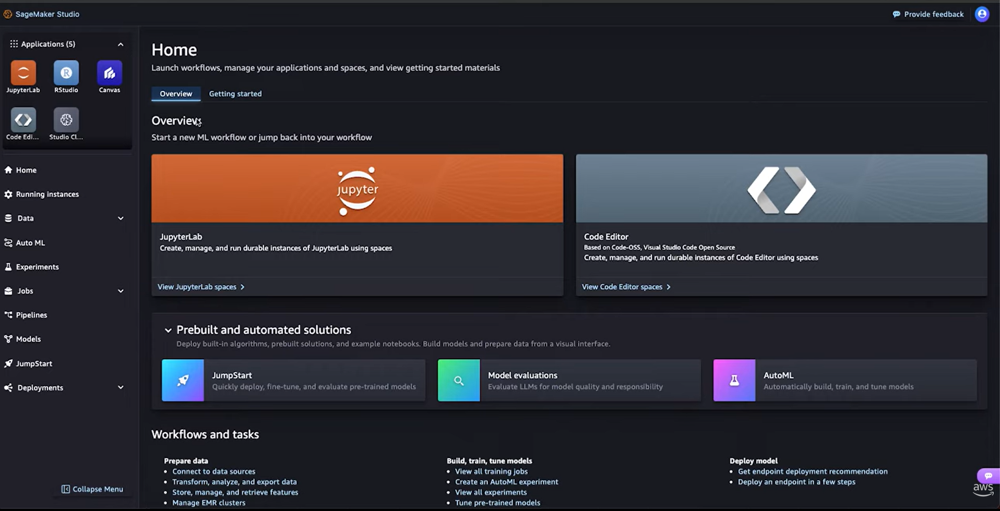
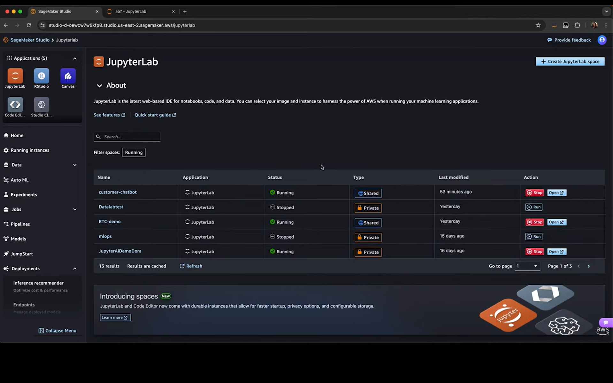
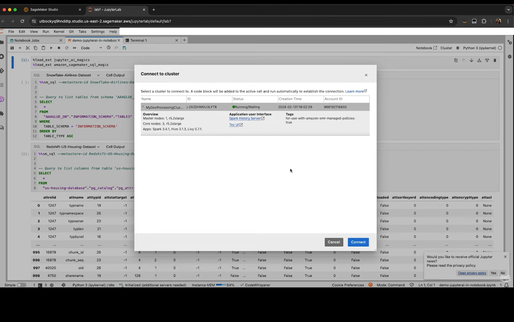
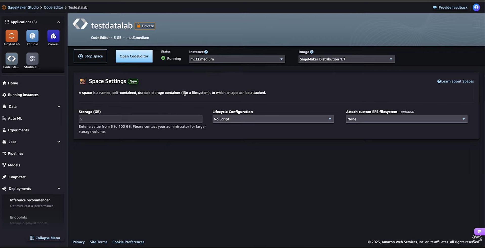
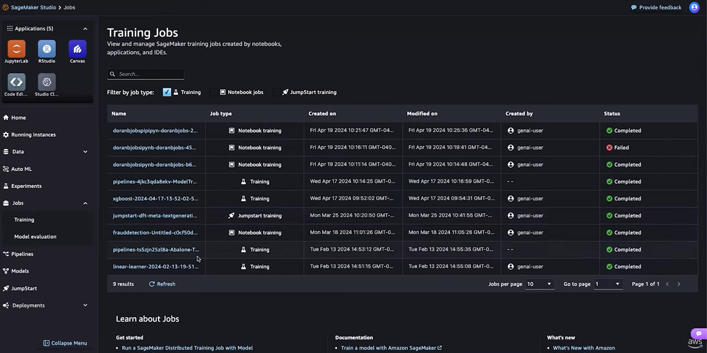
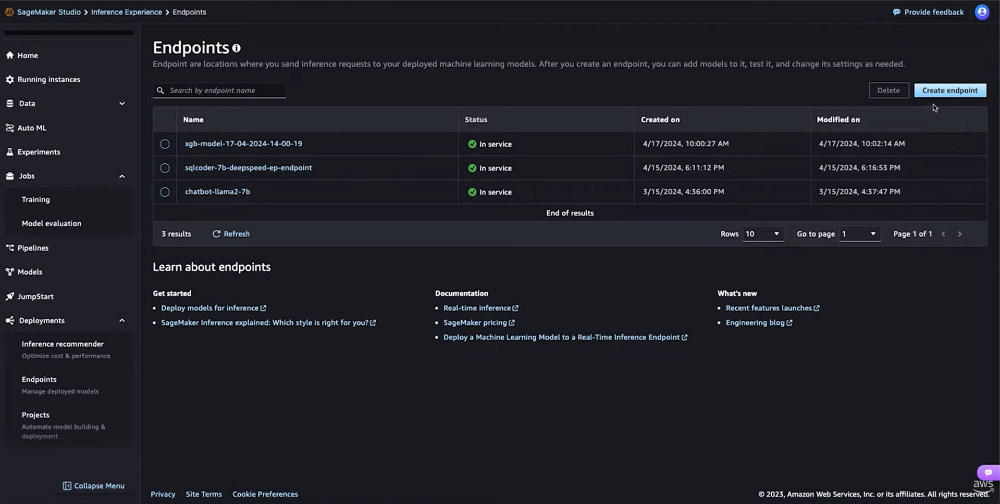

# Amazon SageMaker AI: Mastering the AIOps Lifecycle

## 1. Overview
**Amazon SageMaker AI** is a fully managed service that helps developers and data scientists build, train, deploy, and monitor machine learning models at production scale.

It removes infrastructure-heavy operational work from the ML lifecycle so teams can focus on model quality, experimentation, and reliable delivery.

> Practical distinction: **Bedrock** is focused on managed foundation model APIs, while **SageMaker** provides deeper control for custom model development and end-to-end MLOps workflows.

---

## 2. Core Benefits & Infrastructure

### 1) Managed Compute Resources
SageMaker supports a broad set of CPU and GPU instance types.

- **How it works:** the user experience is managed and streamlined, while execution is powered by AWS compute services (including EC2 infrastructure under the hood).
- SageMaker provisions instances, runs jobs, stores artifacts, and releases resources when finished.
- **SageMaker HyperPod:** for very large training workloads, it optimizes distributed infrastructure across accelerators and can significantly reduce iteration time.

### 2) Integrated Storage
SageMaker leverages a robust storage layer to ensure data persistence and high-performance access throughout the ML lifecycle.

- **Amazon S3:** Serves as the primary data lake for datasets, training scripts, checkpoints, and model artifacts. It acts as the "source of truth," ensuring all assets are versioned and accessible for both distributed training and model deployment.
- **Amazon DynamoDB:** can support low-latency metadata and operational state in broader solution architectures.
- **Amazon EFS:** shared filesystem support for collaborative Studio/Jupyter workflows. It allows multiple team members to share code and data while ensuring that the development environment remains durable even when compute instances are stopped.
- **Data Warehouse Integration:** Connects to Amazon Redshift and Snowflake via SQL. This enables a Lakehouse architecture by combining structured warehouse data with unstructured S3 data for unified analysis.

### 3) Monitoring & AIOps
Monitoring is typically implemented with **SageMaker Model Monitor** plus observability from **Amazon CloudWatch**.

- Captures and analyzes inference data.
- Compares live data distributions against a baseline.
- Detects **data drift** and potential quality degradation.
- Triggers alerts and downstream actions (for example, retraining pipelines).

---

## 3. Quick Walkthrough SageMaker Studio: The Command Center

**SageMaker Studio** is the web-based environment for the end-to-end ML workflow.

### Main interfaces
- **JupyterLab** for data science and experimentation.
- **Code Editor** for software engineering workflows.
- **JumpStart** for pre-built solutions and model starting points.
- **AutoML tools** for automated training workflows.

### Interface Walkthrough



> **Figure 1: SageMaker Studio Home (sagemaker1.jpg).** This is the primary landing page and command center of SageMaker Studio. It exposes quick-start cards for **JupyterLab** and **Code Editor**, includes one-click access to **JumpStart**, **Model Evaluation**, and **AutoML**, and provides a guided **Workflows and tasks** path from data preparation to deployment.



> **Figure 2: JupyterLab Spaces Management (sagemaker4.jpg).** This view demonstrates multi-tenancy and environment isolation through named spaces (for example, `customer-chatbot`, `mlops`, `JupyterAIDemoDora`). Each space exposes run state (**Running/Stopped**), visibility (**Shared/Private**), and direct actions (**Run/Open**) to balance collaboration and cost control.



> **Figure 3: JupyterLab and Big Data Integration (sagemaker5.jpg).** The notebook uses specialized SQL magics such as `%sm_sql` to query enterprise-scale sources including **Snowflake** and **Amazon Redshift**. A visible **Connect to cluster** flow shows how the notebook can be attached to an **Amazon EMR** Spark 3.4.1 cluster for heavy preprocessing and distributed data engineering.
---

## 4. The ML Workflow

### 1) Data Preparation
Within Code Editor or JupyterLab, teams configure hardware and environments for preprocessing tasks.



> **Figure 4: Code Editor Infrastructure Configuration (sagemaker6.jpg).** This screen shows granular setup of a Code Editor space (Code-OSS based), including **instance type** selection (for example, `ml.t3.medium`), **image** selection (for example, SageMaker Distribution 1.7), and **EBS storage sizing** (for example, 5–100 GB). The space is durable, so files persist even when compute is stopped.

### 2) Model Training
SageMaker supports:
- **Built-in algorithms** (optimized managed implementations)
- **Bring Your Own Model (BYOM)** with frameworks such as **PyTorch** and **TensorFlow**

Capabilities include managed training jobs, distributed training, checkpointing, artifact persistence in S3, and hyperparameter tuning.



> **Figure 5: Training Jobs Dashboard (sagemaker2.jpg).** Central experiment log for training history. It tracks job name, run type (for example, **Notebook training** or **JumpStart training**), execution status, author, and timestamps. This creates an auditable trail for collaborative AIOps and makes it easy to compare successful versus failed experiments.

**Example: Starting a training job (Python SDK)**

```python
import sagemaker
from sagemaker.estimator import Estimator

estimator = Estimator(
    image_uri="your-docker-image-uri",
    role=sagemaker.get_execution_role(),
    instance_count=1,
    instance_type="ml.p3.2xlarge",  # GPU instance
    output_path="s3://your-bucket/model-output"
)

estimator.fit({"training": "s3://your-bucket/data"})
```
### 3) Model Evaluation

Before transitioning from training to production, SageMaker provides a comprehensive evaluation phase to ensure model reliability, compliance, and alignment with business objectives.

- **Automated Evaluation.** SageMaker performs systematic validation of model performance and behavior as part of the AIOps lifecycle.
    - **Performance Metrics:** It generates standardized evaluation reports, including accuracy, precision, recall, and other task-specific metrics.
    - **Bias & Fairness:** With tools such as :contentReference[oaicite:2]{index=2}, it identifies potential bias across sensitive attributes and evaluates model fairness.
    - **Model Monitoring Readiness:** Evaluation results can be integrated with monitoring tools to track data drift and performance degradation after deployment.

- **Human Evaluation.** For tasks where automated metrics are insufficient—such as large language model alignment or medical imaging—SageMaker enables human-in-the-loop workflows (e.g., via labeling services) to validate outputs, improve quality, and ensure alignment with domain-specific requirements.


### 4) Model Deployment (Inference)
After training, models are deployed to managed **SageMaker Endpoints**.



> **Figure 6: Endpoints Dashboard (sagemaker3.jpg).** This view represents the live inference layer, listing deployed APIs such as `xgb-model`, `sqlcoder-7b`, and `chatbot-llama2-7b`. Endpoints marked **In service** are actively available for real-time inference, with creation and last-modified timestamps supporting operational monitoring.

#### Deployment Modes
- **Real-time Inference:** always-on, low-latency responses.
- **Serverless Inference:** scales to zero, suitable for intermittent traffic.
- **Asynchronous Inference:** for larger payloads or longer processing jobs.
- **Batch Transform:** offline high-throughput inference.

---


## 5. Personal & Industry Perspective

### Why it scales for healthcare scenarios
For multi-hospital environments and sensitive patient data, SageMaker provides:
1. **Security and governance** via IAM, network isolation, and VPC-based controls.
2. **Hybrid inference patterns** where real-time chatbot endpoints coexist with asynchronous VLM pipelines for imaging-heavy workloads.

### Common challenges
- Initial complexity, especially around IAM and environment setup.
- Cost management, particularly with continuously running GPU endpoints.
